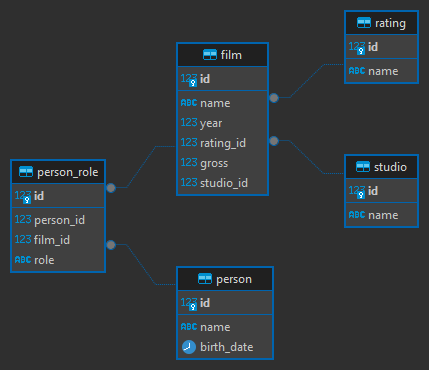

# Movies API

---

`Movies API` is a project I am working on for education purposes. I try to follow `Domain Driven Design`, `Clean Architecture`
and modern backend technologies.

It is written in `Go`, and uses `PostgreSQL` for persistance and `gRPC` for communication.

# Installation

---

Installation includes several steps: run and build the application, and run the database. 
Application can be build manually or  run in the container. The database has to be containerized for schema initialization.

To proceed, you need to `docker compose` be installed on the host machine. If it is not installed, 
you can follow official instructions [here](https://docs.docker.com/compose/install/).

Also for manual building you will need to be familiar with `protobuf`, and have build tools installed.

## Build server

### Manually

---

Manual installation includes running database locally, compilation of `.proto` files, downloading project dependencies and build.
 
#### Run PostgreSQL
Ensure that no database instance is running on port `5432`. If you have conflicting database instance, change the port in the
`docker-compose.yml` file.

To run the DB, navigate to the `script` folder and run the container
```shell
> cd script && docker compose up 
```

This will run `PostgreSQL 14` container and invoke `generate_db.sql` script that fills test data.

To stop the DB and clean up, run the following

```shell
> docker compose down --volumes
```

#### Protobuf
Before running, you must install `gen-go-grpc` and `gen-go` plugins.
Navigate to project root and run the following to compile `.proto` files
```shell
> protoc -I . --go_out=. --go_opt=module=sajoniks.github.io/movieApi --go-grpc_out=. --go-grpc_opt=module=sajoniks.github.io/movieApi ./proto/*.proto
```
This will generate `protobuf` files in the `pkg/proto-gen` directory.

#### Go 

To build Go application, navigate to project root and run

```shell
> go mod download && go run ./cmd 
```

This will run `gRPC` server on port `55005`. 

### Docker

---

Navigate to project root and run the compose file

```shell
> docker compose build && docker compose up
```

# Project Structure

## Domain



There are movies and persons. Each person have a role in a file. One person can have many roles in many films - it is
common situation where the movie director is also plays an actor role. 

A Movie has a rating (age restriction, etc.), and belongs to a single studio. There are no movies with same name in a single 
year. 

A group of Persons with their Roles in a Movie is a Movie Cast.